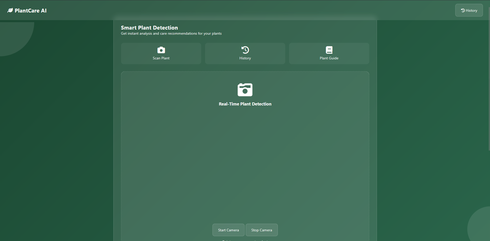

# 🌱 Virtual Plant Care Guide

[](https://opensource.org/licenses/MIT)
[](https://developer.mozilla.org/en-US/docs/Web/JavaScript)
[](https://www.tensorflow.org/js)
[](https://ml5js.org/)
[](https://ai.google.dev/)

> An intelligent web application that detects plant diseases and provides treatment suggestions using machine learning and AI.

## 📋 Table of Contents
- [Overview](#overview)
- [Key Features](#key-features)
- [Demo](#demo)
- [Technology Stack](#technology-stack)
- [Installation](#installation)
- [Usage](#usage)
- [How It Works](#how-it-works)
- [Project Structure](#project-structure)
- [Future Enhancements](#future-enhancements)
- [Contributing](#contributing)
- [License](#license)
- [Contact](#contact)

## 🌟 Overview

Virtual Plant Care Guide is an innovative web application that helps gardeners and plant enthusiasts identify plant diseases and obtain treatment recommendations. By leveraging machine learning and AI technologies, the application analyzes images of plants, detects diseases, and provides expert guidance on how to treat them.

## 🔑 Key Features

- **Plant Disease Detection**: Identify common plant diseases from uploaded images
- **Treatment Recommendations**: Get AI-powered suggestions for treating detected plant conditions
- **User-Friendly Interface**: Simple and intuitive design for users of all experience levels
- **Real-Time Analysis**: Instant feedback on plant health issues
- **Responsive Design**: Works seamlessly across desktop and mobile devices

## 🖼️ Demo

### Disease Detection Screen

*Upload or capture images of your plants to detect diseases*

### Treatment Suggestions

*Receive detailed treatment recommendations for identified plant diseases*

## 🛠️ Technology Stack

- **Frontend**: HTML5, CSS3, JavaScript
- **Machine Learning**: TensorFlow.js, ML5.js, Teachable Machine
- **AI Integration**: Google Gemini AI API
- **Model Training**: Custom dataset trained on Teachable Machine
- **Deployment**: GitHub Pages

## 📥 Installation

1. Clone the repository:
   ```bash
   git clone https://github.com/SahanChamara/Virtual-Plant-Care-Guide.git
